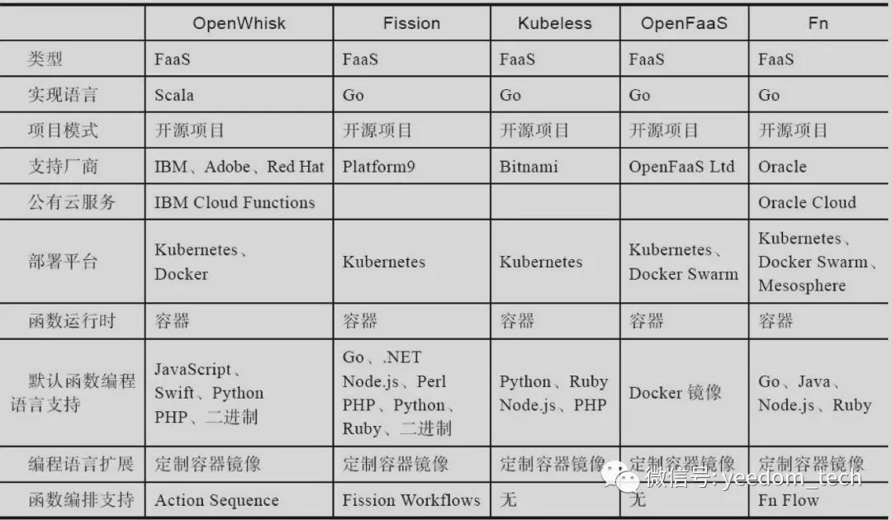
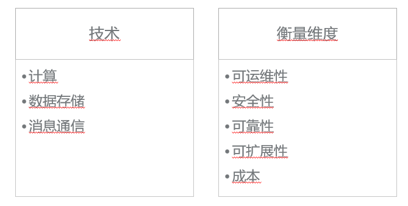
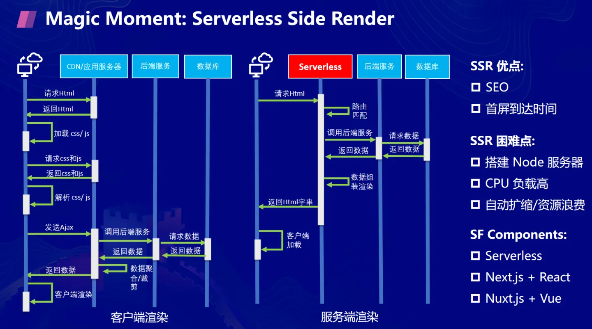

# survey

serveless调研

## 产品罗列：

### 商业化产品：
- awk lambda
- azure function
- tecent serverless cloud function
- google cloud function
- huawei function graph

### 开源产品：

- funktion
- serverless framework
- openfaas
- fn project
- openwhisk
- fission
- nuclio
- shipwright
- cloud native buildpacks
- keda
- dapr
- openfunction
- knative
- kubeless
- serverless

来源：[深入浅出Serverless：3 Serverless的实现](https://cloud.tencent.com/developer/article/1514868?from=article.detail.1515319)

## 测评维度：

1. 安装部署运维
2. 整体资源占用
3. 底层运行时技术
4. 平台整体架构图
5. 开发语言
6. 函数打包机制
7. github人气
8. 函数代码存储, 函数/应用构建流程 (cicd)
9. 文档

## serverless使用场景

| 百分比 | 场景                                                         |
| ------ | ------------------------------------------------------------ |
| 32%    | Web and API serving                                          |
| 21%    | Data Processing, e.g., batch ETL (database Extract, Transform, and Load) |
| 17%    | Integrating 3rd Party Services                               |
| 16%    | Internal tooling                                             |
| 8%     | Chat bots e.g., Alexa Skills (SDK for Alexa AI Assistant)    |
| 6%     | Internet of Things                                           |

来源：https://www2.eecs.berkeley.edu/Pubs/TechRpts/2019/EECS-2019-3.pdf

举例说明：

* 发送通知 push、短信、email
* webhook
* 数据分析
* 定时任务
* 对于前端: ssr与serverless结合，减少首屏白屏时间，优化seo

来源：[什么是serverless无服务?serverless无服务架构原理](https://yuntue.com/post/11683.html)

**serverless与微服务**

来源：[深入浅出Serverless：2 Serverless与相关技术](https://cloud.tencent.com/developer/article/1515318?from=article.detail.1515319)

|          | 微服务                                                   | Serverless                                                   |
| :------- | :------------------------------------------------------- | :----------------------------------------------------------- |
| 功能结构 | 最小成员单位是微服务                                     | 最小成员单位是函数                                           |
| 强调     | 化整为零，提高应用架构灵活度                             | 强调的是“减负”，将服务器移出用户的管理职责范围，降低复杂度和成本 |
| 成本     | 架构上带来灵活性的同时，也增加了开发、部署和运维的复杂度 | 开发和运维的效率更高，管理成本更低                           |

**serverless与paas**

| PaaS         | Serverless                                                   |                                                              |
| :----------- | :----------------------------------------------------------- | ------------------------------------------------------------ |
| 管理颗粒度   | 对应用颗粒度的管理以应用为单位                               | 细致到每个应用的函数                                         |
| 应用部署模式 | 应用是持续地被部署在主机、虚拟主机、容器                     | 按需部署，这是Serverless的按用量付费（Pay-As-You-Use）模型的基础 |
| 作业类型     | 包含长时间运行的应用（如各类Web应用和业务系统）和定时执行的短期任务（如数据分析抽取任务） | 偏向于执行时间跨度比较短的任务                               |
| 实例         | 存在应用实例数这一概念的，用户需要设置每一个实例的CPU和内存的使用大小以及需要的实例数 | 将实例数的概念移除了                                         |

> If your PaaS can efficiently start instances in 20ms that run for half a second, then call it serverless. -- Adrian Cockcroft

来源：[Serverless Architectures](https://martinfowler.com/articles/serverless.html)

## 关键设计点

### 镜像分发
* 懒加载
* p2p镜像加速

### 调度

### 冷启动

* 资源池
* 轻量级容器
* 机器学习预测提前创建

### faas落地灵魂3问
* 存量业务改造
* faas碎片化问题
* 研发提效问题

来源：[1688 复杂业务场景下的 Serverless 提效实践](https://developer.aliyun.com/article/874568?spm=a2c6h.12873639.0.0.771745ffHl9QnW)

### serverless原生心智
1. 我的业务是什么？
2. 做这件事情能不能让我的业务出类拔萃？
3. 如果不能，我为什么要做这件事情而不是让别人来解决这个问题？
4. 在解决业务问题之前没有必要解决技术问题

> 在实践 Serverless 架构时，最重要的心智不是选择哪些流行服务和技术，攻克哪些技术难题，而是时刻铭记在心专注业务逻辑，这样更容易让我们选择合适的技术和服务，明确如何设计应用架构。

来源：[Serverless 架构模式及演进](https://developer.aliyun.com/article/799135)

### serverless架构优缺点

缺点：

* 不适合长时间运行应用
* 供应商绑定
* 开发调试困难
* 不适合高并发应用

优点：

* 降低创业公司启动成本
* 减少运营成本
* 降低开发成本
* 快速上线
* 扩展能力强

来源：[什么是serverless无服务?serverless无服务架构原理](https://yuntue.com/post/11683.html)

## 参考资料：

* [Cloud Programming Simplified: A Berkeley View on Serverless Computing](https://www2.eecs.berkeley.edu/Pubs/TechRpts/2019/EECS-2019-3.pdf)
* [serverless 开源框架对比](https://bbs.huaweicloud.com/blogs/247064)
* [Serverless Open-Source Frameworks: OpenFaaS, Knative, & more](https://www.cncf.io/blog/2020/04/13/serverless-open-source-frameworks-openfaas-knative-more/)
* [Serverless 架构模式及演进](https://developer.aliyun.com/article/799135)
* [Serverless 背景下的前端困境与解决方案](https://developer.aliyun.com/article/726945)
* 

### 微信公众号码农架构
* [通过一个Serverless案例，理解FaaS的运行逻辑](https://mp.weixin.qq.com/s?__biz=MzU3OTc1MDM1Mg==&mid=2247488873&idx=1&sn=a4e057de9f033f164247c549a8ce0f41&chksm=fd6005d6ca178cc0805bad329acfef864b1d3a39713d1e0cb6d48f0798062772ab789fb129cd&scene=178&cur_album_id=1519689351817904130#rd)
* [深入浅出FaaS的两种进程模型](https://mp.weixin.qq.com/s?__biz=MzU3OTc1MDM1Mg==&mid=2247488942&idx=1&sn=151cf4bf16938d8e4fa4fcb4a51c542f&chksm=fd600511ca178c075e0e7ffed228fe98d3fb521310e859f324d97cad06bbdaad9cf76984408c&scene=178&cur_album_id=1519689351817904130#rd)

收费模型：

1. 函数执行时常
2. 调用次数

进程模型：

1. 用完即毁
2. 常驻

* [深入浅出FaaS应用场景之数据编排](https://mp.weixin.qq.com/s?__biz=MzU3OTc1MDM1Mg==&mid=2247488989&idx=1&sn=e29387863da9bcfb3b14156e2039afe6&chksm=fd600562ca178c747287c429a73104c0a2289f7bd5374d3c9d4e23fb3da016664defe50cdf6a&scene=178&cur_album_id=1519689351817904130#rd)
* [如何将后端BaaS化：NoOps的微服务](https://mp.weixin.qq.com/s?__biz=MzU3OTc1MDM1Mg==&mid=2247489068&idx=2&sn=7e6db18d21ecf47511b2c7d4fe55c09a&chksm=fd600693ca178f85806b8e67ebff61cd4647f1702c215e1dc8ea3fccb75496ed88f6bb80d47a&scene=178&cur_album_id=1519689351817904130#rd)
* [如何将后端BaaS化：业务逻辑的拆与合](https://mp.weixin.qq.com/s?__biz=MzU3OTc1MDM1Mg==&mid=2247489116&idx=1&sn=05c1a6a39a109a19af50c7e729ff821a&chksm=fd6006e3ca178ff56dbcc7a1a14d8d597fb3e8ada2c61fb4189782424713d3a6efb4a04a65cd&scene=178&cur_album_id=1519689351817904130#rd)

### open function相关

* [OpenFunction：新一代开源 FaaS 平台](https://www.infoq.cn/article/aqZsasOwiFAYwvGMkU9O)

### 阿里云相关：

* [如何落地一个FaaS平台？](https://developer.aliyun.com/article/769727?spm=a2c6h.14164896.0.0.37a370a9j1AiRj)
* [阿里云 FaaS 架构设计](https://developer.aliyun.com/article/819594?utm_content=m_1000311816)
* [1688 复杂业务场景下的 Serverless 提效实践](https://developer.aliyun.com/article/874568?spm=a2c6h.12873639.0.0.771745ffHl9QnW)

### 字节跳动相关
* [GMTC 2021 演讲 《字节跳动基于 Serverless 的前端研发模式升级》](https://www.shangyexinzhi.com/article/4005226.html) 基于 Serverless 打造一站式前端解决方案 / garfish前端微服务框架
* [BaaS、FaaS、Serverless都是什么馅儿？](https://cloud.tencent.com/developer/article/1145319)

### 美团相关

* [美团Serverless平台Nest的探索与实践](https://tech.meituan.com/2021/04/21/nest-serverless.html)

1. 演进路线: 先建设FaaS函数计算服务，再建设面向应用的Serverless服务
2. 基础设施: k8s
3. 开发语言: java

创新点：

1. sandbox合并部署,同一个pod内存在多个sandbox,此时将pod抽象为node角色,sandbox抽象为pod角色

### 京东云相关
* [Serverless架构设计与落地应用](https://developer.jdcloud.com/article/979) (公开课视频形式)

### 沙箱sandbox相关
* [基于容器化技术的一个沙箱](https://criyle.github.io/2020/04/29/go-judge/)  (go-judge用于faas运行时的局限性 [https://github.com/criyle/go-judge/issues/56](https://github.com/criyle/go-judge/issues/56))

### openfaas

运行时
* 经典watchdog 用完即毁
* 反向代理watchdog 多次请求复用upstream函数
* 流模式 512m内存可响应G级别video
* 静态文件

来源：[OpenFaaS - 以自己的方式运行容器化函数](https://atbug.com/openfaas-case-study-zh/)

### 前端相关 (ssr演变为serverless与ssr结合,进一步演变为前端全栈)

* [彻底理解服务端渲染 - SSR原理](https://github.com/yacan8/blog/issues/30)

> 前后端分离，表面上看上去是代码分离，实际上是为了前后端人员分离，也就是前后端分家，前端不再归属于后端团队。

* [Serverless 应用实践及典型案例解析](https://pic4.zhimg.com/80/v2-c71a8b7e1078e0399d778c53280ffb93_1440w.webp)

